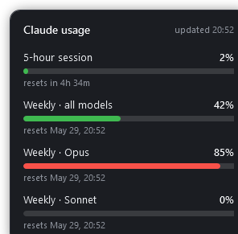
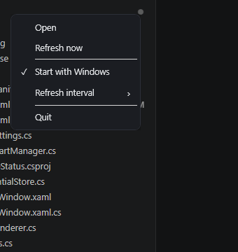

# Claude Status

A lightweight Windows **system-tray** app that shows your live Claude subscription
limits — the 5-hour session window, the weekly (all-models) window, and the
per-model weekly windows (Opus / Sonnet) — the same numbers you see in Claude
Code's `/usage`.

<p>
  
  &nbsp;
  
</p>

## Features

- **Tray badge** showing the chosen limit as a plain percentage, tinted to your
  taskbar theme (white on dark, black on light) for crisp contrast at a glance.
- **Left-click** the tray icon → a borderless flyout, anchored right by the icon,
  with a progress bar and reset time for each limit window.
- **Right-click** → menu: pick **which window the badge tracks** (Highest /
  5-hour / Weekly), set the **refresh interval**, toggle **Start with Windows**,
  refresh now, or quit.
- **Follows the Windows light/dark theme** — the flyout and menu re-tint instantly.
- **No separate login.** It reuses the Claude.ai OAuth token that Claude Code
  already stores, and **refreshes it itself** so the tray keeps working even when
  Claude Code isn't running.

## Download

1. **Install the [.NET 10 Desktop Runtime](https://dotnet.microsoft.com/download/dotnet/10.0) (x64)**
   if you don't already have it — or run `winget install Microsoft.DotNet.DesktopRuntime.10`.
2. Download the latest **`ClaudeStatus.exe`** (~1 MB) from the
   [**Releases**](https://github.com/panstemon/claude-status/releases/latest) page.
3. Run it. On first launch Windows SmartScreen may warn about an unknown publisher
   (the app is unsigned): click **More info → Run anyway**.
4. Right-click the tray badge → **Start with Windows** to have it launch at login.

> Requires Windows 10/11 (x64), the **.NET 10 Desktop Runtime**, and a Claude.ai
> subscription already signed in via [Claude Code](https://claude.com/claude-code)
> (that's where the credentials come from).

## How it works

| Piece | Detail |
|---|---|
| Usage data | `GET https://api.anthropic.com/api/oauth/usage` with the OAuth bearer token, `anthropic-beta: oauth-2025-04-20`, and a `claude-code/<ver>` User-Agent. |
| Token | Read from `%USERPROFILE%\.claude\.credentials.json` (`claudeAiOauth`). |
| Token refresh | When expired, `POST https://claude.ai/v1/oauth/token` (grant_type=refresh_token); the new token is written back to the same file. |
| Autostart | Per-user `HKCU\Software\Microsoft\Windows\CurrentVersion\Run` value (no admin needed). |
| Settings | `%APPDATA%\ClaudeStatus\settings.json` — poll interval and badge source. |
| Theme | Follows `AppsUseLightTheme` (flyout/menu) and `SystemUsesLightTheme` (badge). |

> ⚠️ The usage endpoint is **undocumented** and may change without notice. It's all
> isolated in `src/UsageClient.cs`, so it's easy to adjust if it ever moves.

## Build from source

Requires the [.NET 10 SDK](https://dotnet.microsoft.com/download).

```powershell
# run directly
dotnet run --project src

# build the single-file exe that ships in releases
# (framework-dependent: needs the .NET 10 Desktop Runtime to run)
dotnet publish src -c Release -r win-x64 --self-contained false -p:PublishSingleFile=true -o release
```

## Project layout

```
src/
├── App.xaml(.cs)         # tray icon, context menu, poll loop, theme switching
├── FlyoutWindow.xaml(.cs)# the borderless status popup
├── UsageClient.cs        # usage endpoint + OAuth token refresh
├── CredentialStore.cs    # read/write ~/.claude/.credentials.json
├── IconRenderer.cs       # theme-adaptive monochrome tray badge
├── AutostartManager.cs   # HKCU Run-key toggle
├── AppSettings.cs        # settings persistence (interval, badge source)
├── ThemeManager.cs       # Windows light/dark detection
├── Theme.xaml            # context-menu styles
├── Theme.Light/Dark.xaml # swappable light/dark palettes
├── Severity.cs           # clay/red bar colors
└── Models.cs             # data models
```

## License

[MIT](LICENSE) — © 2026 Bohdan Denysenko.

This is an unofficial tool and is not affiliated with or endorsed by Anthropic.
